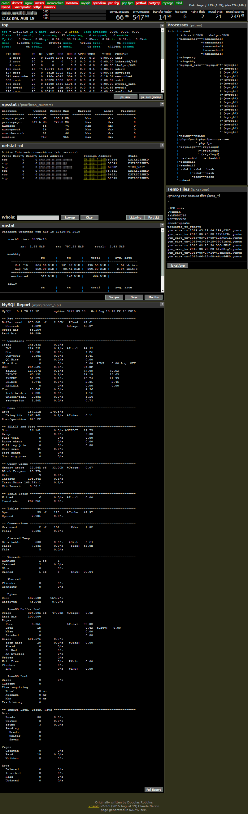
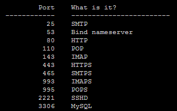
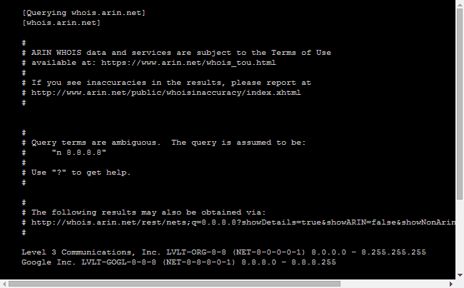
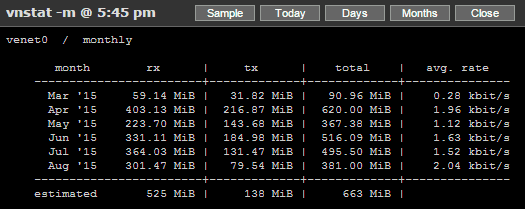

##### Table of Contents
* [Introduction](#intro)
* [General Requirements](#require)
* [Installation](#installation)
* [Requirements for Specific Blocs](#require_bloc)
* [Configuration](#config)
* [Screenshots](#screens)


<a name="intro"/>
# Introduction

Vpsinfo is a Linux server monitoring script, written in PHP, that provides web access to system status information. It gathers the output from several common Linux commands into one web page, providing a quick overview of the system's current state.

While designed for use on a Linux Virtual Private Server (Virtuozzo or OpenVZ), Vpsinfo also works fine on a dedicated server. When installed on a dedicated machine VPS-specific information is automatically excluded.

Please note that, on Virtuozzo and OpenVZ servers, the small beanc helper app may be required to access VPS status information.

vpsinfo shows the following outputs:
- `top`
- `/proc/user_beancounters` (VPS resources)
- `netstat -nt` (current TCP connections)
- `netstat -ntl` (listening TCP ports)
- `pstree` (tree view of running processes)
- `ls -a /tmp` (and ls -al /tmp )
- `vnstat` (network traffic at the interface)
- `mytop` (MySQL stats)
- `mysqlreport` (perl script, MySQL stats)
- Status of daemon processes
- Top summary section:
	- Values for oomguarpages and privvmpages (free RAM and swap usage)
	- Data transfer today through the network interface (from vnstat)
	- Current number of TCP connections
	- Web server threads, MySQL threads and queries (from mytop or mysqlreport)
	- Disk usage


## Optional Third-party Software
These applications are not required to run vpsinfo, but if installed they are used to gather additional information
- vnstat (data transfert monitoring at the network interface) Highly recommended!
- mytop  (MySql monitoring)
- mysqlreport  (perl script, MySql monitoring).

<a name="require"/>
# General Requirements
- Linux operating system
- webserver ([Nginx](http://nginx.org/), [Apache](http://httpd.apache.org/) ...)
- PHP v5.4+
- Perl
- Gcc compiler (for beanc)

<a name="installation"/>
# Installation
For the time being, installation documentation is limited to CentOS. Please share any relevant information you may have that may complete this documentation, and I will include it.

## Perl
Intallation on CentOS 6.x:
```bash
yum install \
perl-DBI \
perl-DBD-mysql --enablerepo=rpmforge-extras
```
*[rpmforge http://repoforge.org/](http://repoforge.org/)
(other perl modules may be needed)

## Gcc
Intallation on CentOS 6.x:
```bash
yum install \
gcc \
glibc-devel \
glibc-headers
```
(may be incomplete)

## Web Server
### Nginx
Server configuration bloc example:
```nginx
server {
	listen       	123.45.67.89:443 ssl;
    server_name  	VPSINFO.MYSERVER.COM;
	root 			/var/www/VPSINFO;

	### RESTRICTION ###
	# your restrictions

	### HEADERS ###
	add_header  	Cache-Control 					"public";

	### SSL - TLS ###
	add_header 		Strict-Transport-Security 		max-age=31536000;
	ssl_session_cache           shared:SSL:1m;
	ssl_certificate 			/etc/pki/https/PUBLIC_CERTIFICATE.crt;
	ssl_certificate_key 		/etc/pki/https/PRIVATE_KEY.pem;
    ssl_client_certificate      /etc/pki/CA/SELF_SIGNED_CA_CERTIFICATE.crt;
    ssl_verify_client           on;

	ssl_protocols               TLSv1.2 TLSv1.1 TLSv1;
	ssl_session_timeout         15m;

	ssl_ciphers  				HIGH:!MD5:!aNULL:!eNULL:!NULL:!DH:!EDH:!kEDH:!AESGCM;
	ssl_prefer_server_ciphers	on;

	location / {
		try_files $uri $uri/ /index.php?$args;
	}

	### FAST CGI CONFIGURATION
	location 	~* 		\.php$ {
		try_files 		$uri 		=404;

		fastcgi_pass   					unix:/var/run/php-fpm-www.sock;
		fastcgi_split_path_info 		^(.+\.php)(/.+)$;
		fastcgi_intercept_errors 		off;
		fastcgi_index 					index.php;
		fastcgi_param SCRIPT_FILENAME 	$document_root$fastcgi_script_name;

		include 						fastcgi.conf;

		fastcgi_cache_valid  			60m;
	}


	### LOGGING ###
}
```
Note the `ssl_client_certificate`. This is actually the server's public certificate, and the private key is installed in my desktop/browser. The first time, in a single run of my browser, the server request a certificate; the browser is aware of my private key and offers to send one of my keys, which I do; then I gain access to my VpsInfo page.

The `ssl_verify_client = on` prevents access without a verified certificate.

Using a certificate for authentication (vs password) avoids the possibility of password brute force.

<a name="require_bloc"/>
# Requirements for Specific Blocs

## [vnstat](http://humdi.net/vnstat/)

Installation on CentOS 6.x:
```bash
$ yum install vnstat --enablerepo=rpmforge
```

Configuring vnstat:
- get the name of the network interface:
```bash
$ ifconfig
```
you should see a `venet0` or a `eth0` for KVM's (do not use `venet0:x`).

- update `/etc/sysconfig/vnstat`:
`VNSTAT_OPTIONS="-i venet0"`

- you may also need to update `/etc/vnstat.conf`:
`interface "venet0"`

- make sure `/etc/cron.d/vnstat` exists and contains:
`*/5 * * * * vnstat /usr/sbin/vnstat.cron`

- you can test with:
```bash
$ vnstat -tr
```

## MySQL Report
The report should use the included `mysqlreport_a.pl`. For MySql earlier to v5.0, `mytop` seems to be the other option.

### mysqlreport A
The included mysqlreport_a.pl is a modified version of mysqlreport (2008) compatible with MySQL/Percona v5+.

### mysqlreport B
The included mysqlreport_b.pl is a modified version of [mysqlreport (2015)](https://github.com/jb-boin/mariadb/blob/5.5.30/debian/additions/mysqlreport) compatible with MySQL/Percona v5+ & MariaDB (according to the [author](https://mariadb.atlassian.net/browse/MDEV-573)).

### [mytop](http://jeremy.zawodny.com/mysql/mytop/)
Installation on CentOS 6.x:
```bash
$ yum install mytop --enablerepo=epel
```
Note: this option is untested. Mytop was built for MySQL 3.22.x, 3.23.x, and 4.x., but is said to [work](https://www.howtoforge.com/tutorial/mytop-mysql-database-monitoring/#about-mytop) with v5.0 .

## beanc
beanc is a 10 lines C program that fetches the old, but still valid, [/proc/user_beancounters](https://wiki.openvz.org/Proc/user_beancounters) data on a Linux [Virtuozzo](http://www.odin.com/products/virtuozzo/) v.3 or [OpenVZ](http://openvz.org/) VPS (Virtual Private Server).

Installation on CentOS 6.x:
```bash
$ cd VPSINFO-FOLDER-PATH/installation/beanc/
$ sh install.sh
```


<a name="config"/>
# Configuration
This is a partial list of configuration entries. For the complete list and description, please refer to `config.php`.

**$vnstat**</br>
`0 = disabled`</br>
`1 = enabled`</br>

**$mysql_mon**</br>
`0 = none`</br>
`1 = mytop`</br>
`2 = mysqlreport_a   (mysql/percona)`</br>
`3 = mysqlreport_b   (mysql/percona, MariaDB)`</br>

**$mysql_mon**</br>
`0 = none`</br>
`1 = mytop`</br>
`2 = mysqlreport_a   (mysql/percona)`</br>
`3 = mysqlreport_b   (mysql/percona, MariaDB)`</br>

**Database Access**</br>
Not needed if `$mysql_mon = 0`.</br>

Socket has priority if defined.</br>
`$my_socket = '/var/lib/mysql/mysql.sock';`</br>

Then host IP if no socket. Avoid 'localhost', save a dns lookup.</br>
`$my_host   = '127.0.0.1';`</br>
`$my_port   = '3306';`</br>

Only required by mytop</br>
`$my_db     = 'mysql';`</br>

And authentication.</br>
`$my_user   = 'USERNAME';`</br>
`$my_pass   = 'PASSWORD';`</br>
`$userhome = '/USERNAME';`</br>

**$processes**</br>
`crond dovecot nginx master memcached monitorix mysqld php-fpm rsyslogd sshd vsftpd miniserv`</br>
Process names that appear in a `ps -e` command output are shown as 'up'.</br>


<a name="screens"/>
# Screenshots
## Main page</br>


## Pop-ups
### Top


Popup:</br>


Popup:</br>


Popup:</br>


### Netstat


Popup:</br>


Popup:</br>


#### Whois
In the netstat list:</br>


In the footer of the netstat bloc:</br>


Popup:</br>


### Vnstat
Clic any one:</br>
  

Popup:</br>


### MySQL Report


Popup:</br>


### Temp files</br>


Popup:</br>


